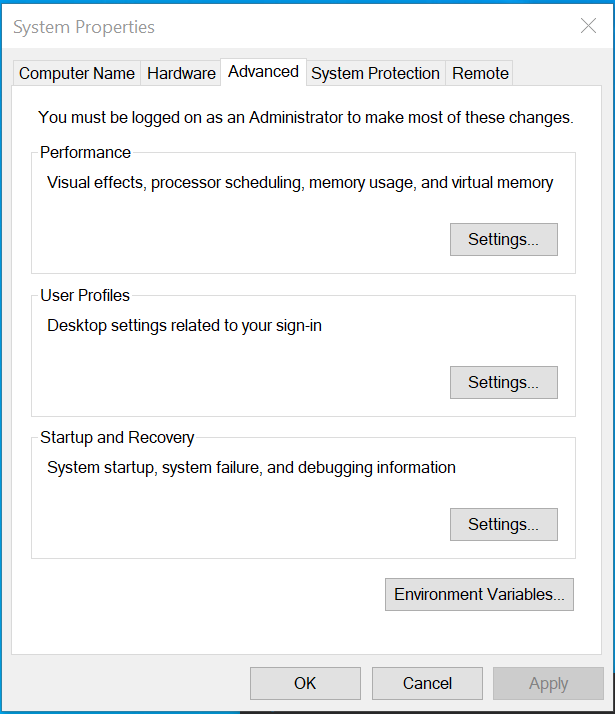
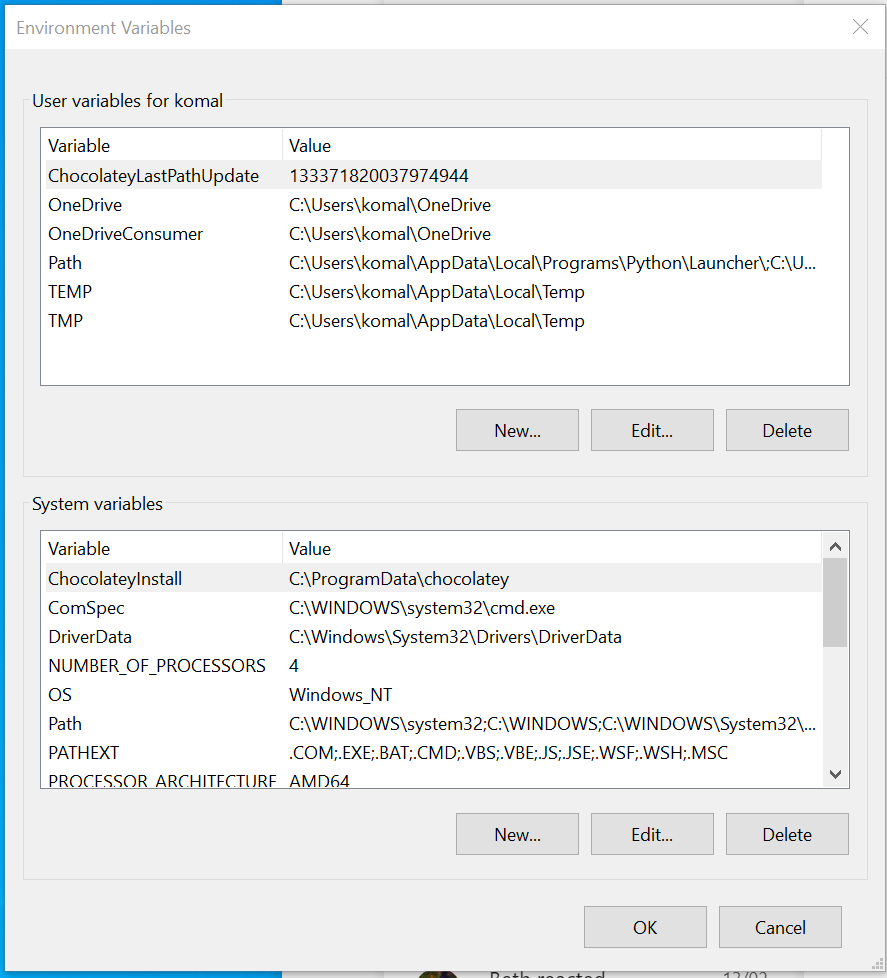

# PostgreSQL Exercise

Connecting Python to a back-end Database

In this exercise we will install the PostgreSQL database management system (DBMS), add some data to it and then access that data using Python.

## Installing PostgreSQL

Follow these steps to install the PostgreSQL DBMS on your local computer.

### Download and Install

[PostgreSQL](https://www.postgresql.org/download/).

This downloads the installer app which will then install the actual DBMS.

Double-click to start the install.

Take defaults as prompted.

If asked to enter a password for user-ID `postgresql` try to leave it blank. If it insists on a password, enter one that is easy to remember. You will need this later to access the data from Python.

Towards the end it will ask to install `stack builder`. De-select this option and click NEXT. 

### Post-installation Tasks

#### Verify installation

   Check that PostgreSQL has installed. Find and click **START>Progress SQL 16>pgadmin 4**. The DBMS should start after a few seconds. You can create a short-cut to the pgAdmin4 icon on your desktop for future use.

#### Change Environment Path

   You may need to change your PC configuartioan to include the PostgreSQL path to your system.

   For Windows, locate Control Panal and select **Advanced>Environment Variables**.

Select **PATH** and click **EDIT**

    

